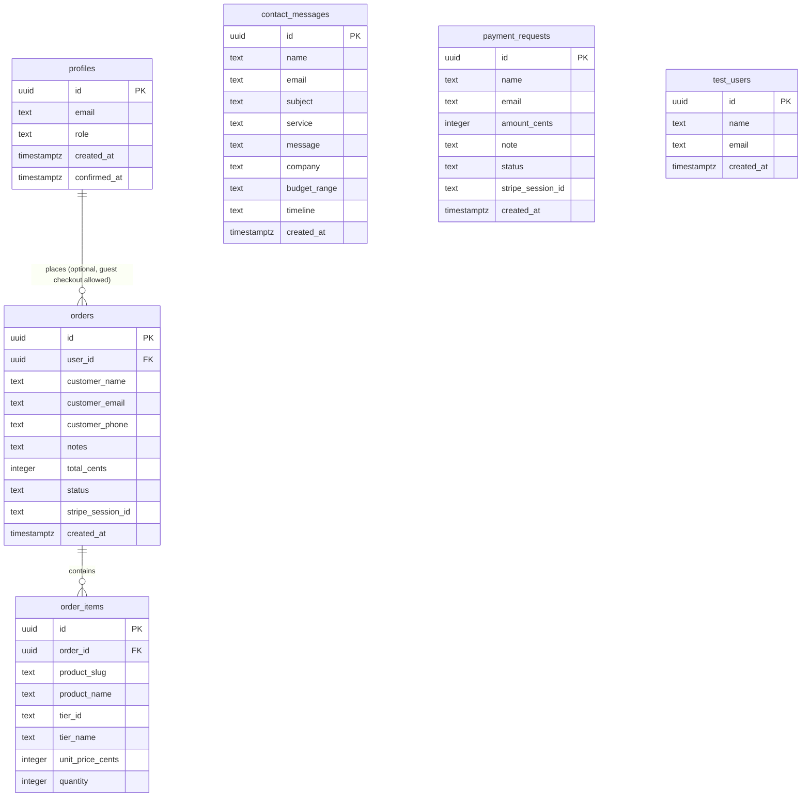

# Database schema

Entity diagram for the Supabase project (project ref `oqygkcauoxxkrergfotc`). Source of truth for the actual DDL is `db/schema.sql` in the repo root.

Notes:

- `profiles.id` references `auth.users.id` (Supabase auth), kept in sync by the `handle_new_user` and `handle_user_confirmed` triggers.
- `orders.user_id` is nullable because checkout does not require an account.
- `contact_messages.company`, `budget_range`, and `timeline` were added when the site moved to the new custom software, AI and automation, and web and mobile apps positioning, so the contact form can capture project context beyond name and message.
- `test_users` is a scratch table left over in the live database, not used by the app.
- Row level security is enabled on every table. Guests can insert into `orders`, `order_items`, `contact_messages`, and `payment_requests`, but can only read their own rows (or nothing, if not signed in). Admin reads and updates go through the `is_admin()` helper, which checks `profiles.role = 'admin'`.
